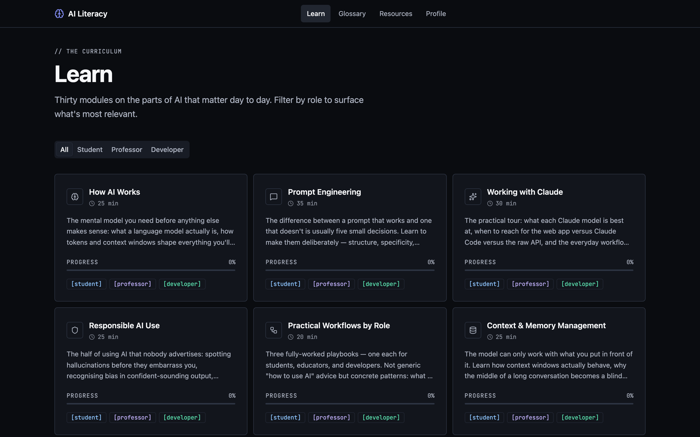

# AI Literacy App

Learn to use AI like it matters: a role-adaptive course on how LLMs work, prompt engineering, Claude workflows, and responsible AI use — with a live Claude Prompt Lab and an explorer of how AI exposure lands on real occupations.

**Live:** [ai-literacy-app-seven.vercel.app](https://ai-literacy-app-seven.vercel.app)



## What it does

- **Role-adaptive learning** — pick student, professor, or developer; content depth and framing adjust to the role
- **Thirty structured modules** — readings, callouts, quizzes, and hands-on exercises on AI fundamentals, prompt frameworks, reusable templates, and practical Claude workflows
- **Prompt Lab** *(appears when a backend is configured)* — a live sandbox against Claude; choose the model and max tokens. The Anthropic key never leaves the server: a FastAPI proxy makes the call and rate-limits per IP (slowapi)
- **Occupation explorer** *(appears when a backend is configured)* — Louisiana occupations scored for AI exposure, augmentation vs. automation, and wage premium from public sources (BLS OEWS, O\*NET, Eloundou et al., the Anthropic Economic Index); search, compare two side by side, and see linked megaprojects and job postings. Method in [DATA.md](DATA.md)
- **Glossary, assessment, resources** — reference terms, a self-assessment, and curated further reading
- **Local progress** — role and progress persist in the browser (Zustand + localStorage); no accounts

## Tech stack

| Layer | Technology |
|-------|-----------|
| Frontend | React 19, Vite, TypeScript, Tailwind CSS v4, shadcn/ui |
| State | Zustand (persist middleware) + TanStack Query |
| Routing | React Router v7 |
| Backend | FastAPI (Python 3.13), uvicorn, slowapi |
| AI | Claude via the backend proxy |
| Deployment | Vercel serves the static course; the backend runs anywhere uvicorn does |

## Quickstart

Two processes: the Vite frontend and the FastAPI backend. Modules, glossary, resources, and progress are static and work with the frontend alone. The Prompt Lab and the occupation explorer call the backend, and they appear only when `VITE_API_URL` points at one (step 3 below) — otherwise the build is the static course and never makes a request.

Prerequisites: Node 22, [pnpm](https://pnpm.io), Python 3.13, and [uv](https://docs.astral.sh/uv/).

```bash
git clone https://github.com/Artem1bar/ai-literacy-app.git
cd ai-literacy-app
```

Frontend:

```bash
cd frontend
pnpm install
pnpm dev          # http://localhost:5173
```

Backend, in a second terminal:

```bash
cd backend
uv sync
cp .env.example .env               # add your ANTHROPIC_API_KEY
uv run uvicorn main:app --reload   # http://localhost:8000
```

Then point the frontend at it and restart `pnpm dev`:

```bash
cd frontend
cp .env.example .env.local         # VITE_API_URL=http://localhost:8000
```

Checks:

```bash
cd frontend && pnpm test && pnpm build   # vitest suite, production bundle in dist/
cd backend && uv run pytest              # Claude is stubbed in tests — no key needed
```

### Environment variables

Frontend — copy `frontend/.env.example` to `frontend/.env.local`:

| Variable | Description |
|----------|-------------|
| `VITE_API_URL` | Backend base URL, read at build time. **Set → the Prompt Lab and occupation explorer are routed and linked; unset → the static course, with those surfaces hidden and no backend calls.** `http://localhost:8000` for local dev; a public URL or `/` (same origin) when self-hosting |

Backend — copy `backend/.env.example` to `backend/.env`:

| Variable | Description |
|----------|-------------|
| `ANTHROPIC_API_KEY` | Anthropic API key (server-side only, never exposed to the frontend) |
| `ALLOWED_ORIGINS` | Comma-separated CORS origins; default `http://localhost:5173` |
| `RATE_LIMIT` | slowapi rate-limit string for `/api/prompt`; default `10/minute` |

Only those three keys may appear in `.env` — Settings rejects unknown ones. `STARJOBS_STUB` (default `true`, stubbed job postings until a public Star Jobs API exists) is read from the process environment instead.


## Project structure

```
frontend/
├── src/
│   ├── components/   # Layout, learn, lab, occupations, score-card, resources, profile, ui
│   ├── data/         # All content as TypeScript data files (modules, templates, resources)
│   ├── hooks/        # Custom React hooks
│   ├── lib/          # API client, utilities, constants
│   ├── pages/        # Home, Learn, Module, Lab, Occupations, Compare, Glossary, Resources, Profile
│   └── store/        # Zustand stores
backend/
├── routers/          # FastAPI route handlers (health, prompt, occupation, jobs)
├── services/         # Claude client, occupation repository, Star Jobs client
├── data/             # Per-occupation JSON records, seeds, checksums
├── scripts/          # Data ingest scripts (BLS OEWS, O*NET, Eloundou)
└── config.py         # Settings via env vars
```

## Adding content

All module content lives in `frontend/src/data/` as TypeScript data files — no component changes needed:

- `modules.ts` — learning modules with sections, blocks (paragraphs, callouts, quizzes, lists)
- `prompt-frameworks.ts` — prompt engineering frameworks
- `prompt-templates.ts` — reusable prompt templates
- `resources.ts` — curated external links
- `user-roles.ts` — role definitions and display config

Occupation records live in `backend/data/occupations/<soc>.json`; see [backend/data/README.md](backend/data/README.md) for the refresh workflow.

## Deployment

`vercel.json` builds `frontend/` as a static Vite site and rewrites every path to `index.html` so deep links resolve; pushes to `main` deploy automatically. No `VITE_API_URL` is set there, so the live site is the static course — home, modules, glossary, resources, progress — and the Prompt Lab and occupation explorer are not offered. Nothing on the live site calls a backend.

To publish those features too, run the backend somewhere uvicorn can (with `ANTHROPIC_API_KEY` and `ALLOWED_ORIGINS` including the frontend origin), then add `VITE_API_URL=<its URL>` under Vercel → Project → Settings → Environment Variables (Production) and redeploy. The variable is read at build time, so a redeploy is required.

## Status

Working MVP, actively developed. A fresh clone was verified on 2026-09-04: frontend install, tests, and build pass, and the backend syncs and passes its tests. The Vercel deployment is the static course; the Prompt Lab and occupation explorer appear when a backend is configured (`VITE_API_URL`), which is how local development runs.

## Built with

Developed with Claude Code as the coding agent; Claude also powers the in-app Prompt Lab.

## License

[MIT](LICENSE)
